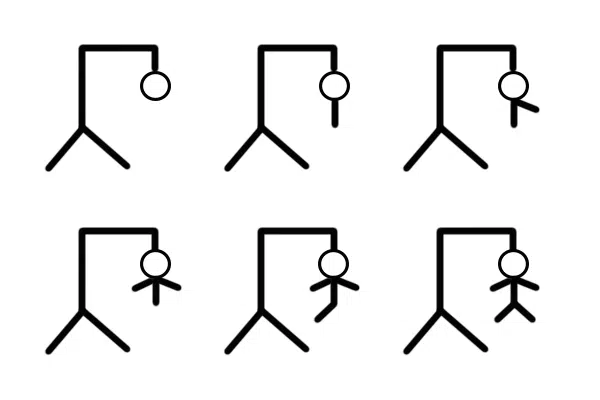

  

# Parcial 1 - "Ahorcado"

Se pide construir una aplicación de consolas en Java que permita a una 
persona jugar al tradicional juego del ahorcado, en el que un jugador 
intenta adivinar una palabra oculta letra por letra antes de que se 
complete la figura del ahorcado. La aplicación debe cumplir con los 
siguientes requisitos:

1. La aplicación debe iniciar con un mensaje de bienvenida y pedir el nombre del jugador.
2. El juego debe ser para un solo jugador, que jugará contra la computadora. 
3. La aplicación deberá elegir una palabra aleatoria de una lista predefinida. 
4. La palabra elegida deberá ocultarse y mostrarse como una serie de guiones bajos. 
5. El jugador deberá ingresar una letra en cada turno. Si la letra se encuentra en la palabra oculta, se mostrarán todas las posiciones en las que aparece. Si la letra no se encuentra en la palabra, se restará una vida al jugador. Opcionalmente, se mostrará la parte correspondiente del dibujo del ahorcado o se irán mostrando los intentos restantes por pantalla. 
6. El jugador tendrá un total de 6 vidas (intentos) para adivinar la palabra. Si pierde todas las vidas antes de adivinar la palabra, pierde el juego. 
7. El juego deberá tener un sistema de puntuación en el que se otorgan 2 puntos por cada letra adivinada correctamente y se descuenten puntos por cada vida perdida hasta 0 (límite en el que no se podrán descontar más puntos). 
8. Por cada partida ganada por el jugador, se le otorgarán 10 puntos extras a los obtenidos por las letras. 
9. La aplicación debe permitir al jugador jugar otra partida si lo desea, y si se juega otra partida, la aplicación debe proponer una nueva palabra y reiniciar el contador de vidas (intentos). 
10. La aplicación debe llevar un registro de cuantas partidas ganó y perdió el jugador durante una misma ejecución. Si el jugador decide no volver a jugar, debe mostrar por pantalla cuantas partidas ganó, cuantas perdió y un mensaje de despedida

La aplicación debe estar construida utilizando programación orientada a 
objetos usando Java y debe utilizar un enfoque modular. La lógica del juego 
debe estar separada de la lógica de presentación. Se deben escribir Test que 
validen la solución implementada (Al menos se deben desarrollar los Test de un 
método público y uno privado, contemplando sus límites)
